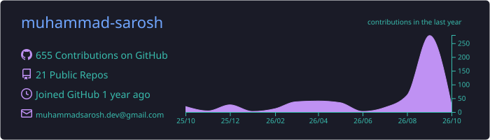
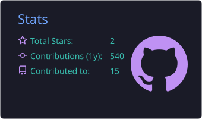

  

  <b>Building practical AI systems that connect tools, data, and workflows.</b> 
  BS Data Science · Python · APIs · n8n · Backend Systems

  
  

---

## 👨‍💻 About me

I’m a BS Data Science student interested in **AI engineering, automation, and backend systems**. I like building tools that connect APIs, data, and services into useful workflows.

- 🛠️ I build automation-heavy side projects, usually around repetitive or annoying problems.
- 🐍 Most of what I make involves some mix of Python, APIs, bots, desktop apps, and backend logic.
- 🤖 I’m especially interested in AI that actually does things — calling tools, moving data between services, and triggering workflows.
- 🌱 Right now I’m exploring n8n, RAG, agents, and LLM-powered workflows.

## 🛠️ Languages & tools

**AI & automation**

  
  
  
  
  

**Languages**

  
  
  
  
  

**Desktop & web**

  
  
  
  

**Data & tooling**

  
  
  
  

  
  
  
  

## 📊 GitHub activity

  

  
  

  
  

